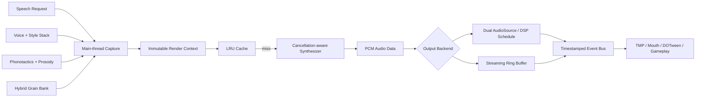

# Architecture

## Main-thread capture

`ScriptableObject`, `AnimationCurve` ve `AudioClip` okumaları yalnızca capture aşamasında yapılır. Sonuç; voice, phonotactics, prosody ve hybrid grain verisini taşıyan immutable snapshot’lardır.

## Planning

Planner Unicode grapheme’leri ve rich-text tag’lerini ayırır; her syllable için onset, vowel, coda, source range, word, phrase, pitch, timing ve mouth shape üretir. Aynı text + configuration + seed aynı planı üretir.

## Synthesis

Core renderer stateless’tir. Formant bank, PolyBLEP waveform, consonant transient, hybrid grain, oversampling, DC conditioning ve headroom kontrolü uygular. `IAdvancedGibberishSynthesizer` cancellation destekler.

## Playback

AudioClip backend iki `AudioSource`, `AudioSettings.dspTime`, `PlayScheduled` ve equal-power crossfade kullanır. Streaming backend tek producer/consumer ring buffer üzerinden audio callback’e kilitsiz veri taşır.

## Extension boundaries

- `IAdvancedGibberishUtterancePlanner`
- `IAdvancedGibberishSynthesizer`
- `IAdvancedGibberishSpeechService`
- `IGibberishEventBus`
- `IGibberishAssetResolver`

Core assembly integration frameworklerine bağımlı değildir.
